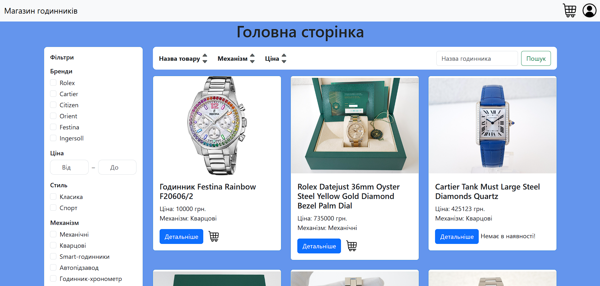
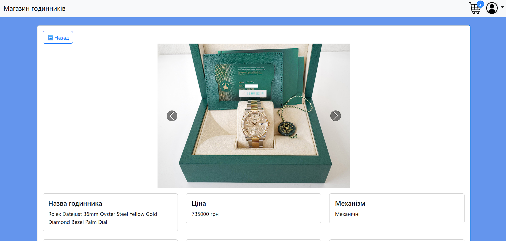
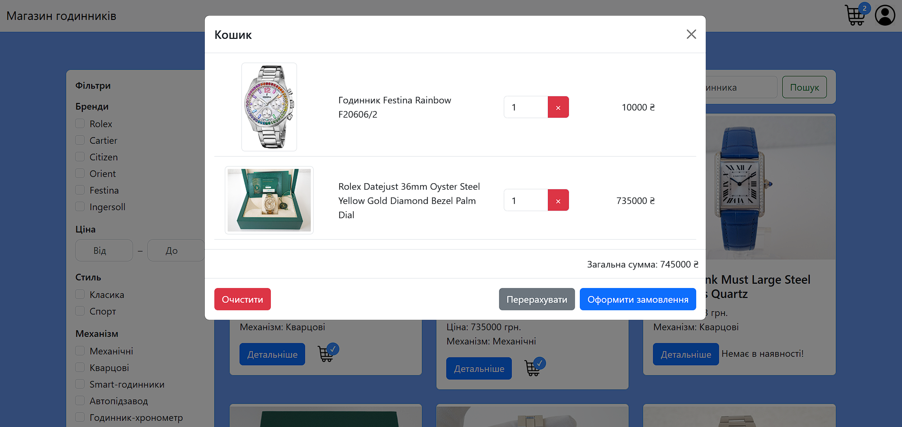
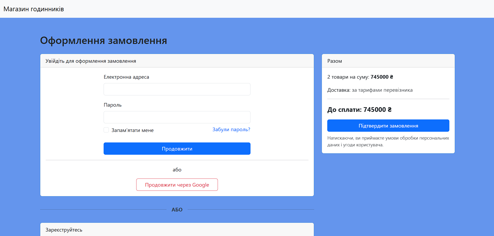
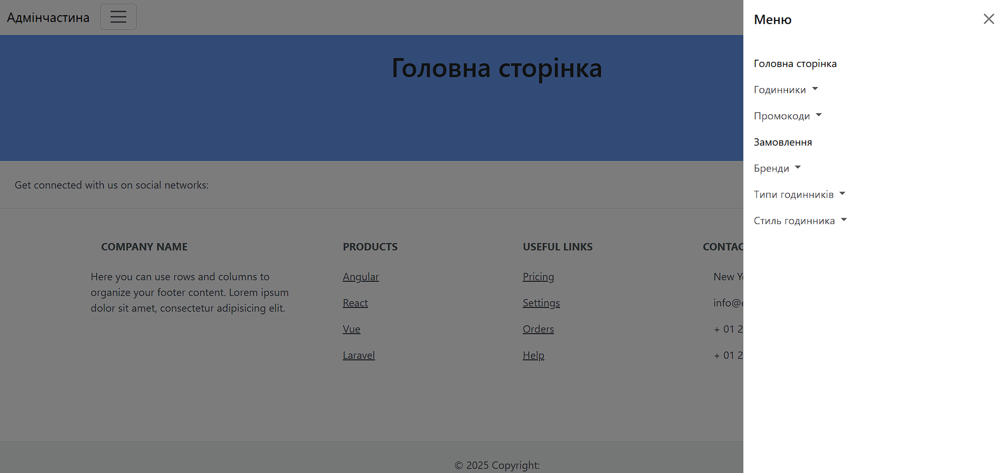
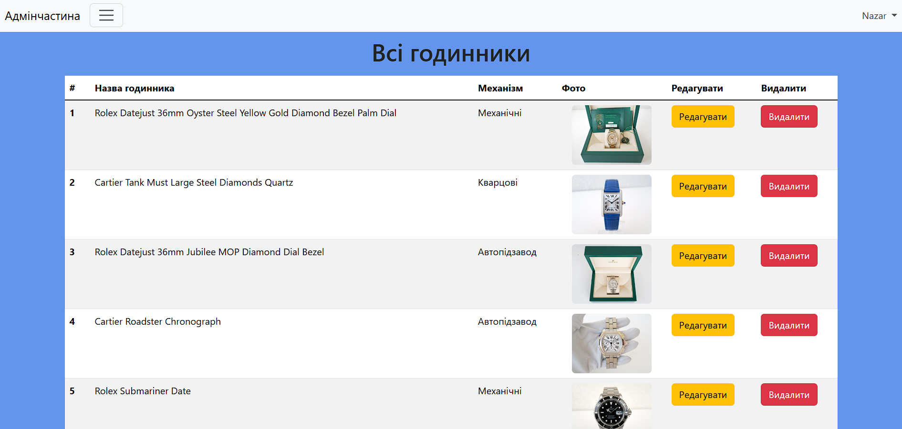

<p align="center"><a href="https://laravel.com" target="_blank"></a></p>

<p align="center">
<a href="https://github.com/laravel/framework/actions"></a>
<a href="https://packagist.org/packages/laravel/framework"></a>
<a href="https://packagist.org/packages/laravel/framework"></a>
<a href="https://packagist.org/packages/laravel/framework"></a>
</p>

# ShopLaravel 

## English Version  

**ShopLaravel** – an online store built with the **Laravel** framework.  
This project was created to practice and utilize as many Laravel features as possible while implementing a fully functional e-commerce platform.  

### About Laravel  

**Laravel** is a modern PHP framework for building scalable and maintainable web applications.  
It provides clean syntax, built-in authentication system, routing, database management via Eloquent ORM, queues, mail system, API integrations, and much more – all of which speed up development and keep the codebase clean.  

## Features  
- Homepage  
- Product catalog with filtering  
- Product search  
- Shopping cart  
- Checkout page  
- Delivery selection (Nova Poshta integration)  
- Online payment (LiqPay integration)  
- Registration and login (including Google OAuth)  
- Admin panel with extended functionality  

### Admin Panel Features  
- Product management (create, edit, delete)  
- Order management with detailed view  
- Promo code generation and management  

## 🛠️ Technologies  
- **Laravel 12.0.1**  
- PHP 8.2  
- MySQL / MariaDB  
- Bootstrap 5.3  
- JavaScript, CSS
- Mailtrap
- External APIs: LiqPay, Nova Poshta, Google OAuth 2.0  

## ⚙️ Installation and Setup  
1. Clone the repository to your server.  
2. Import the `shopLaravel.sql` database dump into your **MySQL** database.  
   ⚠️ After import, it is recommended to delete the `shopLaravel.sql` file.  
3. Configure the `.env` file with your database credentials:  
   - `DB_HOST` – database server address  
   - `DB_PORT` – port  
   - `DB_DATABASE` – database name  
   - `DB_USERNAME` – username  
   - `DB_PASSWORD` – password  
4. Create a symbolic link for images:  
   ```bash
   php artisan storage:link
   ```
5. Add all required **API keys** to the `.env` file:   
   - **For sending emails:**                                                                                                                                                                                        
     `MAIL_MAILER`, `MAIL_HOST`, `MAIL_PORT`, `MAIL_USERNAME`, `MAIL_PASSWORD`

   - **For Google authentication:**                       
    `GOOGLE_CLIENT_ID`, `GOOGLE_CLIENT_SECRET`, `GOOGLE_REDIRECT_URI`

   - **For LiqPay:**                    
    `LIQPAY_PUBLIC_KEY`, `LIQPAY_PRIVATE_KEY`

   - **For Nova Poshta:**                   
    `NP_API_KEY`
6. *(Optional)* To enable Laravel Debugbar or IDE Helper, set in `.env`:                             
   ```env
    APP_DEBUG=true
   ```
7. Start your server.

## 👤 User Roles  
- **Customer**: browse catalog, manage cart, place orders
- **Administrator**: full access to admin panel, product management, order management, promo code management, and employee registration                       
- **Admin panel login credentials**:
  - Email: `nazarsnitka813@gmail.com`  
  - Password: `12345678Asd!` 

---

## Українська версія  

**ShopLaravel** – це інтернет-магазин, розроблений на фреймворку **Laravel**.  
Цей проєкт створено з метою практики та використання максимальної кількості можливостей Laravel, водночас реалізовуючи повноцінний функціонал інтернет-магазину.  

### Про Laravel  

**Laravel** – це сучасний PHP-фреймворк для створення масштабованих та підтримуваних веб-додатків.  
Він надає зручний синтаксис, вбудовану систему авторизації, маршрутизацію, роботу з базами даних через ORM Eloquent, черги, поштову систему, інтеграцію з API та багато іншого – усе це пришвидшує розробку і робить код чистим.  

## Функціонал  
- Головна сторінка  
- Каталог товарів з фільтрацією  
- Пошук товарів  
- Корзина  
- Оформлення замовлення  
- Вибір доставки (інтеграція з Новою Поштою)  
- Онлайн-оплата (інтеграція LiqPay)  
- Реєстрація та авторизація (включаючи Google) 
- Адмін-панель з розширеним функціоналом  

### Можливості адмін-панелі  
- Управління товарами (створення, редагування, видалення)  
- Управління замовленнями з детальним переглядом  
- Генерація та редагування промокодів   

## 🛠️ Технології  
- **Laravel 12.0.1**  
- PHP 8.2  
- MySQL / MariaDB  
- Bootstrap 5.3  
- JavaScript, CSS
- Mailtrap
- Зовнішні API: LiqPay, Нова Пошта, Google OAuth 2.0

## ⚙️ Встановлення та налаштування  
1. Клонуйте репозиторій на ваш сервер.  
2. Імпортуйте дамп бази даних `shopLaravel.sql` у вашу базу даних **MySQL**.                    
   ⚠️ Після імпорту рекомендується видалити файл `shopLaravel.sql`.  
3. Налаштуйте файл `.env` вказавши параметри бази даних:  
   - `DB_HOST` – адреса сервера бази даних  
   - `DB_PORT` – порт  
   - `DB_DATABASE` – назва бази  
   - `DB_USERNAME` – логін  
   - `DB_PASSWORD` – пароль  
4. Створіть симлінк для зображень:                                 
   ```bash
   php artisan storage:link
   ```
5. Додати у файл `.env` всі необхідні **API-ключі**:   
   - **Для відправки листів**:                                                                                                                                                                                      
     `MAIL_MAILER`, `MAIL_HOST`, `MAIL_PORT`, `MAIL_USERNAME`, `MAIL_PASSWORD`

   - **Для Google-автентифікації**:                       
    `GOOGLE_CLIENT_ID`, `GOOGLE_CLIENT_SECRET`, `GOOGLE_REDIRECT_URI`

   - **Для LiqPay**:                    
    `LIQPAY_PUBLIC_KEY`, `LIQPAY_PRIVATE_KEY`

   - **Для Нової Пошти**:                  
    `NP_API_KEY`
6. (Необов’язково) Щоб увімкнути Laravel Debugbar або IDE Helper, змініть у `.env`:                              
   ```env
    APP_DEBUG=true
   ```
7. Запустіть ваш сервер.

## 👤 Ролі користувачів  
- **Користувач**: перегляд каталогу, корзина, оформлення замовлення 
- **Адміністратор**: повний доступ до адмін-панелі, управління товарами, замовленнями, промокодами та реєстрація працівників                       
- **Дані для входу в адмін-панель**:
  - Email: `nazarsnitka813@gmail.com`  
  - Пароль: `12345678Asd!`
 
## 📸 Скріншоти/Sreenshot
<p align="center">
  <br>
	<em>Каталог товарів/Product Catalog</em>
</p>
<p align="center">
  <br>
	<em>Детальніше/Product Details</em>
</p>
<p align="center">
	<br>
	<em>Корзина/Shopping cart</em>
</p>
<p align="center">
	<br>
	<em>Оформлення замовлення/Order Checkout</em>
</p>
<p align="center">
	<br>
	<em>Оформлення замовлення після аутентифікації/Authenticated Checkout</em>
</p>
<p align="center">
	<br>
	<em>Адмін-панель/Admin panel</em>
</p>
<p align="center">
	<br>
	<em>Управління товарами/Product Management</em>
</p> 
